# Breaking Bad — Albuquerque Explorer

**▶ Play it: [metaforismo.github.io/breakingbad](https://metaforismo.github.io/breakingbad/)**

A Three.js open-world fan game. Walk and drive through the iconic places of
the series, rebuilt procedurally (no external assets — every texture is
generated at runtime on canvas).

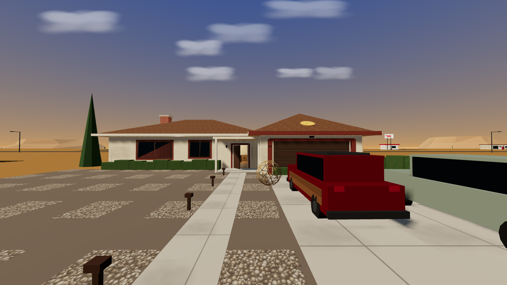

## Screenshots

| | |
|:--:|:--:|
| 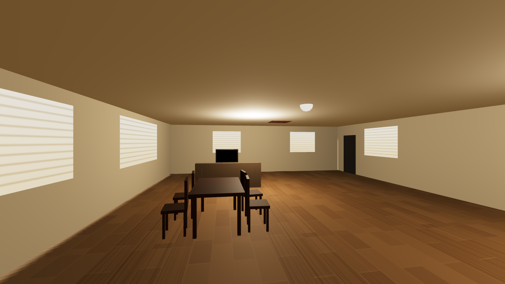 | 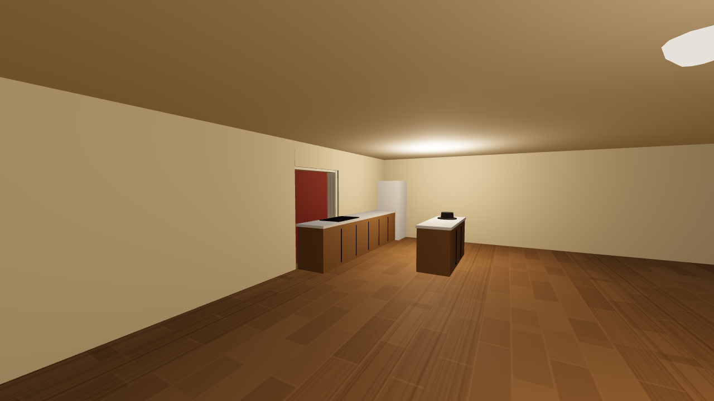 |
| *Walk inside the White house...* | *...past the kitchen island* |
| 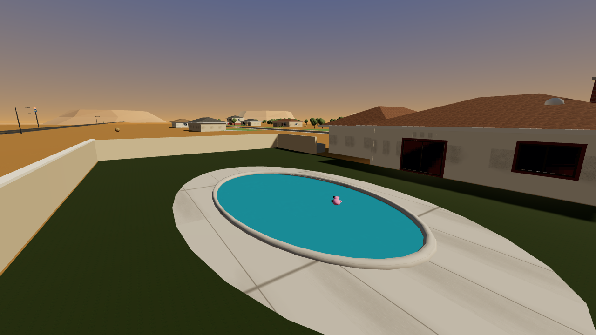 | 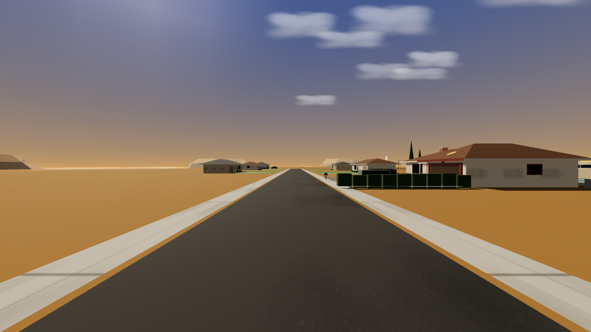 |
| *The backyard pool* | *The suburban street* |
| 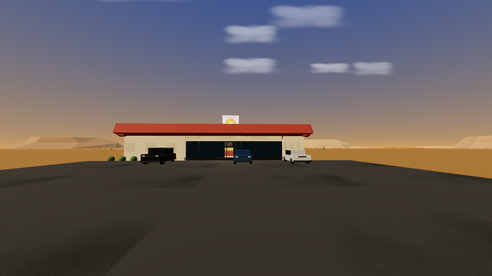 | 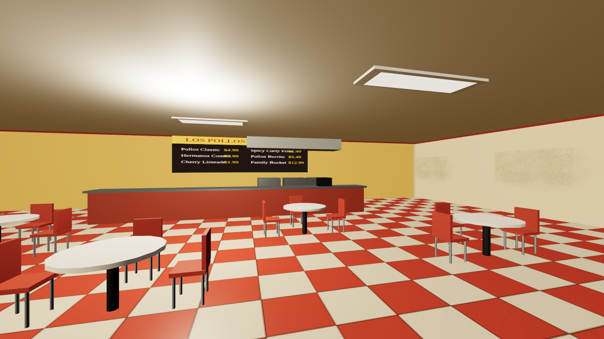 |
| *Los Pollos Hermanos* | *...and its dining room* |
| 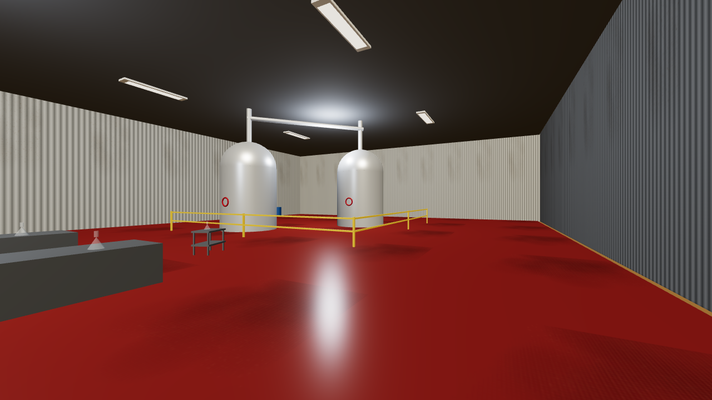 | 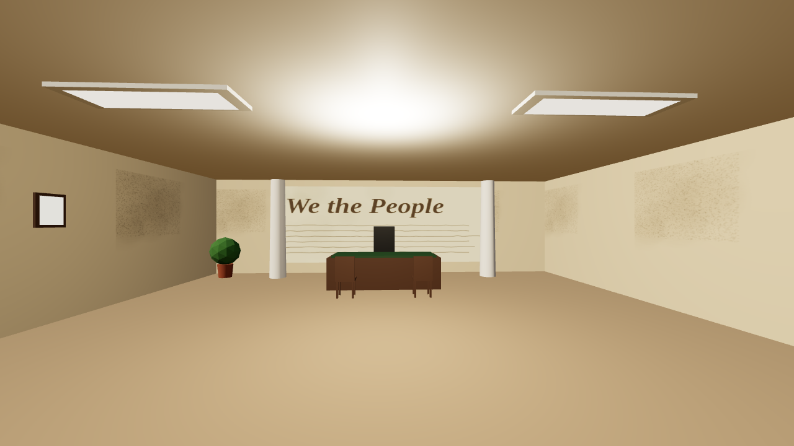 |
| *The superlab under the laundry* | *Saul Goodman's office* |
| 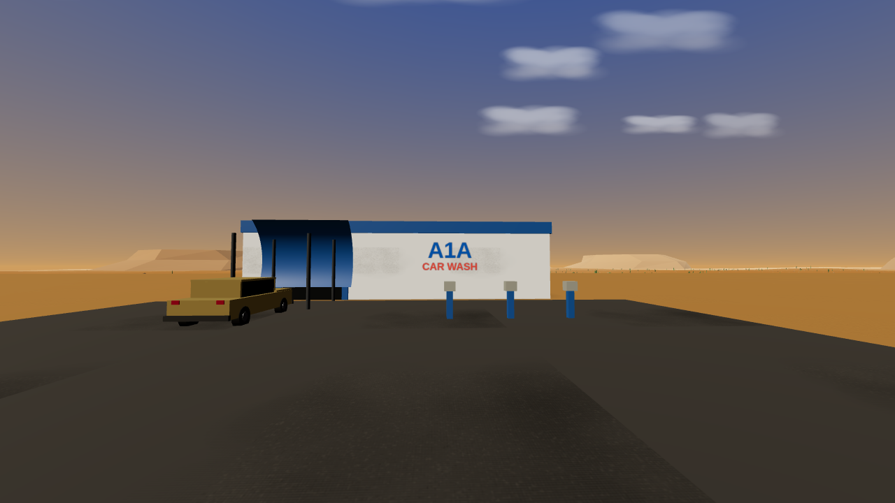 | 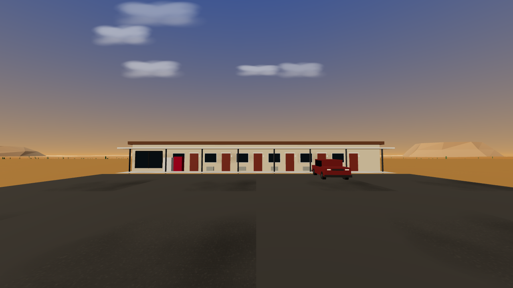 |
| *A1A Car Wash* | *Crossroads Motel* |
| 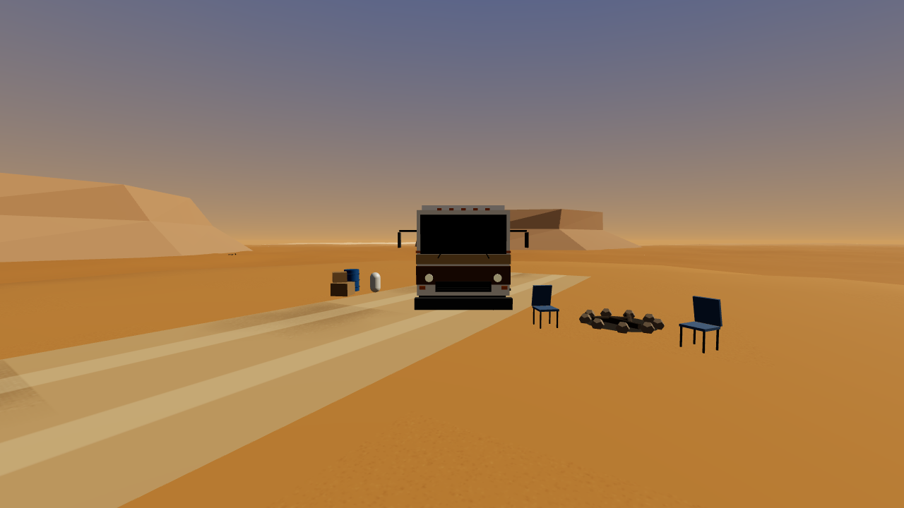 | |
| *The RV cook site in the Tohajiilee desert* | |

## Locations

- **308 Negra Arroyo Lane** — the White residence: cream stucco, maroon trim,
  the garage jutting toward the street, river-rock front yard, backyard pool
  with the pink teddy bear floating in it... and the pizza on the garage roof.
- **Negra Arroyo Lane** — a full suburban street with neighbor houses, lawns,
  driveways, shade trees and street signs. Jesse's two-story place sits at the
  west end of the lane.
- **Central Avenue** — the commercial strip: **Los Pollos Hermanos** (logo
  pole sign included), **Saul Goodman & Associates** (inflatable Statue of
  Liberty wobbling on the roof, "BETTER CALL SAUL!" banner), the **A1A Car
  Wash** and the **Lavandería Brillante** industrial laundry.
- **Crossroads Motel**, **the Dog House** drive-in (dachshund sign included)
  and the **Schrader residence** (purple accents, Hank's grill and SUV).
- **Tohajiilee Desert** — leave town on the dirt track to find the RV cook
  site: the 1986 Fleetwood Bounder, camp chairs, the methylamine barrel and a
  fire ring, surrounded by dunes, saguaros and distant mesas. Somewhere out
  there is a freshly dug hole at N 34° 59' 20" — W 106° 36' 52".

## Interiors

Three buildings are walkable:

- **308 Negra Arroyo Lane** — through the ajar front door: living room with
  couch and TV, dining set, the kitchen with its island (Heisenberg's
  pork-pie hat is on it), and the open slider to the pool deck.
- **Los Pollos Hermanos** — checkered dining room with booths, tables,
  service counter, menu board and the fryer line.
- **Lavandería Brillante** — the man door leads straight onto the superlab
  floor: red epoxy, twin steel reaction vessels, yellow railings, lab benches
  with glassware, and two yellow hazmat suits on the wall.

## Driving

Walt's Pontiac Aztek and Skyler's wood-panelled Wagoneer are parked on the
driveway; the RV waits at the cook site. Walk up to a door and press **E**.

## Controls

| Input | Action |
| --- | --- |
| `W A S D` / arrows | move / drive & steer |
| Mouse | look around |
| `Shift` | run |
| `Space` | jump |
| `E` | enter / exit vehicles |
| `Esc` | pause (release mouse) |

## Running

```bash
npm install
npm run dev        # development server
npm run build      # production build into dist/
npm run preview    # serve the production build
```

## Performance

Tuned for 60 fps: instanced desert vegetation, merged geometries, a capped
pixel ratio, a tight shadow frustum that follows the player, fog-limited draw
distance and procedural canvas textures generated once at startup. An FPS
meter sits in the top-right corner.

## Deployment

Every push to `main` runs the GitHub Actions workflow in
`.github/workflows/deploy.yml`: it builds the site with Vite and publishes
`dist/` to the `gh-pages` branch, which GitHub Pages serves at
[metaforismo.github.io/breakingbad](https://metaforismo.github.io/breakingbad/).
If the URL ever shows a 404, set **Settings → Pages → Source: Deploy from a
branch → `gh-pages` / (root)** once.

## Dev scripts

```bash
node scripts/screenshot.mjs   # headless screenshots of key locations (needs `npm run preview` running)
node scripts/drive-test.mjs   # automated walk/enter/drive smoke test
```

Both need Playwright's Chromium (`npx playwright install chromium`).
